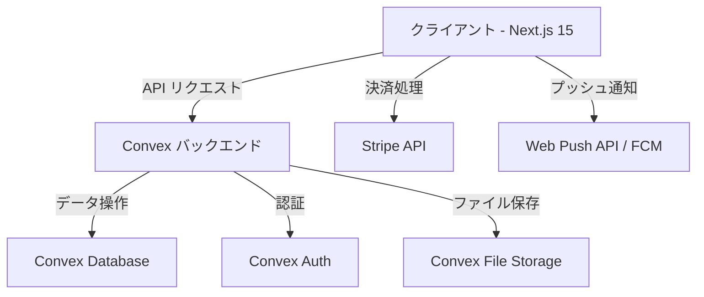

# デザイン文書

## 概要

マッチョ専用マッチングアプリは、筋トレ・フィットネス愛好者に特化したマッチングプラットフォームです。このアプリはTinder風のスワイプ機能をベースとし、男性ユーザーに対する厳格な審査制度を導入することで、質の高いマッチング環境を提供します。本デザイン文書では、アプリケーションのアーキテクチャ、コンポーネント、データモデル、エラー処理、およびテスト戦略について詳細に説明します。

## アーキテクチャ

### 全体アーキテクチャ

マッチョ専用マッチングアプリは、Next.js 15（App Router）をフロントエンド、Convexをバックエンドとするフルスタックアプリケーションとして設計されています。



### 技術スタック

- **フロントエンド**: Next.js 15 (App Router)
  - React Server Components
  - クライアントコンポーネント
  - TailwindCSS（UIスタイリング）
  - Shadcn UI（UIコンポーネント）

- **バックエンド**: Convex
  - サーバーレス関数
  - リアルタイムデータ同期
  - WebSocketベースの通信

- **データベース**: Convex Database
  - NoSQLデータベース
  - リアルタイムクエリ

- **認証**: Convex Auth
  - メール/パスワード認証
  - OAuth（Google, Apple）

- **ファイルストレージ**: Convex File Storage
  - 画像アップロード
  - プロフィール写真
  - 身分証明書

- **決済**: Stripe
  - サブスクリプション管理
  - 支払い処理

- **通知**: Web Push API / FCM
  - プッシュ通知
  - アプリ内通知

## コンポーネントとインターフェース

### フロントエンドコンポーネント

```mermaid
graph TD
    App[App] --> Auth[認証モジュール]
    App --> Profile[プロフィールモジュール]
    App --> Matching[マッチングモジュール]
    App --> Messaging[メッセージングモジュール]
    App --> Admin[管理者モジュール]
    App --> Payment[決済モジュール]
    App --> Notification[通知モジュール]
    
    Auth --> Login[ログイン]
    Auth --> Register[新規登録]
    Auth --> Verification[本人確認]
    
    Profile --> ProfileEditor[プロフィール編集]
    Profile --> PhotoUpload[写真アップロード]
    Profile --> Settings[設定]
    
    Matching --> SwipeInterface[スワイプインターフェース]
    Matching --> MatchList[マッチリスト]
    Matching --> Filters[検索フィルター]
    
    Messaging --> ChatList[チャットリスト]
    Messaging --> ChatRoom[チャットルーム]
    Messaging --> MediaSharing[メディア共有]
    
    Admin --> VerificationQueue[審査キュー]
    Admin --> UserManagement[ユーザー管理]
    Admin --> Analytics[分析ダッシュボード]
    
    Payment --> Plans[プラン選択]
    Payment --> Checkout[決済処理]
    Payment --> History[決済履歴]
    
    Notification --> PushManager[プッシュ管理]
    Notification --> InAppNotifications[アプリ内通知]
```



### バックエンドサービス

#### Convex関数

1. **認証サービス**
   - `auth.register`: ユーザー登録
   - `auth.login`: ログイン
   - `auth.verifyIdentity`: 本人確認審査提出
   - `auth.verifyMuscle`: 筋肉確認審査提出

2. **プロフィールサービス**
   - `profile.create`: プロフィール作成
   - `profile.update`: プロフィール更新
   - `profile.getById`: プロフィール取得
   - `profile.uploadPhoto`: 写真アップロード

3. **マッチングサービス**
   - `matching.getProfiles`: スワイプ用プロフィール取得
   - `matching.like`: いいね送信
   - `matching.pass`: パス（スキップ）
   - `matching.getMatches`: マッチリスト取得

4. **メッセージングサービス**
   - `messaging.sendMessage`: メッセージ送信
   - `messaging.getConversation`: 会話履歴取得
   - `messaging.markAsRead`: 既読設定
   - `messaging.uploadMedia`: メディアアップロード

5. **管理者サービス**
   - `admin.getVerificationQueue`: 審査キュー取得
   - `admin.approveVerification`: 審査承認
   - `admin.rejectVerification`: 審査却下
   - `admin.getUserList`: ユーザーリスト取得
   - `admin.updateUserStatus`: ユーザー状態更新

6. **決済サービス**
   - `payment.createCheckoutSession`: 決済セッション作成
   - `payment.handleWebhook`: Stripeウェブフック処理
   - `payment.getHistory`: 決済履歴取得

7. **通知サービス**
   - `notification.send`: 通知送信
   - `notification.getAll`: 通知一覧取得
   - `notification.markAsRead`: 通知既読設定

### APIインターフェース

#### RESTエンドポイント

- `/api/stripe/webhook`: Stripeウェブフック受信
- `/api/push/subscribe`: プッシュ通知登録

#### Convexクエリ/ミューテーション

Convexは独自のクエリ/ミューテーションシステムを提供し、フロントエンドからバックエンドへのアクセスを簡素化します。

```typescript
// クライアント側の例
const user = useQuery(api.profile.getById, { id: userId });
const sendMessage = useMutation(api.messaging.sendMessage);

// メッセージ送信
await sendMessage({ recipientId, content, type: "text" });
```

## データモデル

### ユーザーモデル

```typescript
interface User {
  _id: Id<"users">;
  email: string;
  passwordHash: string;
  createdAt: number;
  lastActive: number;
  status: "active" | "suspended" | "banned";
  role: "user" | "admin";
  verificationStatus: {
    identity: "pending" | "approved" | "rejected" | "not_submitted";
    muscle?: "pending" | "approved" | "rejected" | "not_submitted"; // 男性のみ
  };
  subscription: {
    level: "free" | "premium";
    expiresAt?: number;
    stripeCustomerId?: string;
    stripeSubscriptionId?: string;
  };
  dailyLikes: {
    count: number;
    resetAt: number;
  };
  pushSubscription?: PushSubscription;
}
```

### プロフィールモデル

```typescript
interface Profile {
  _id: Id<"profiles">;
  userId: Id<"users">;
  
  // 基本情報
  nickname: string;
  gender: "male" | "female" | "other";
  birthDate: string; // YYYY-MM-DD
  age: number; // 計算済み
  location: string;
  bio: string;
  
  // オプション情報
  photos: Array<{
    _id: Id<"storage">;
    url: string;
    isPrimary: boolean;
  }>;
  occupation?: string;
  income?: string;
  education?: string;
  
  // 体型・身体情報
  physique?: {
    height?: number; // cm
    weight?: number; // kg
    bodyFatPercentage?: number; // %
    bodyType?: "slim" | "athletic" | "muscular" | "bulky" | "physique";
  };
  
  // トレーニング情報
  training?: {
    squatMax?: number; // kg
    benchPressMax?: number; // kg
    deadliftMax?: number; // kg
  };
  
  // ライフスタイル情報
  lifestyle?: {
    smoking?: "non_smoker" | "occasional" | "smoker" | "e_cigarette" | "quitting";
    personality?: string[];
    hobbies?: string[];
    weekendActivities?: string;
  };
  
  // マッチング設定
  matchPreferences?: {
    relationshipType?: "dating" | "friendship" | "workout_partner";
    ageRange?: { min: number; max: number };
    distance?: number; // km
    genderPreference?: Array<"male" | "female" | "other">;
  };
}
```

### 審査モデル

```typescript
interface Verification {
  _id: Id<"verifications">;
  userId: Id<"users">;
  type: "identity" | "muscle";
  documentId: Id<"storage">; // アップロードされた画像/文書
  status: "pending" | "approved" | "rejected";
  submittedAt: number;
  reviewedAt?: number;
  reviewedBy?: Id<"users">; // 審査した管理者
  rejectionReason?: string;
}
```

### マッチングモデル

```typescript
interface Like {
  _id: Id<"likes">;
  fromUserId: Id<"users">;
  toUserId: Id<"users">;
  createdAt: number;
  status: "active" | "passed";
}

interface Match {
  _id: Id<"matches">;
  userIds: [Id<"users">, Id<"users">]; // マッチした2ユーザー
  createdAt: number;
  lastMessageAt?: number;
  isActive: boolean;
}
```

### メッセージモデル

```typescript
interface Message {
  _id: Id<"messages">;
  matchId: Id<"matches">;
  senderId: Id<"users">;
  content: string;
  type: "text" | "image";
  mediaId?: Id<"storage">; // 画像の場合
  createdAt: number;
  readAt?: number;
}
```

### 通知モデル

```typescript
interface Notification {
  _id: Id<"notifications">;
  userId: Id<"users">;
  type: "match" | "message" | "verification" | "system";
  title: string;
  body: string;
  data?: Record<string, any>; // 追加データ
  createdAt: number;
  readAt?: number;
  isRead: boolean;
}
```

### 決済モデル

```typescript
interface Payment {
  _id: Id<"payments">;
  userId: Id<"users">;
  stripePaymentId: string;
  amount: number;
  currency: string;
  status: "succeeded" | "pending" | "failed";
  createdAt: number;
  planType: "monthly" | "yearly";
}
```

## エラー処理

### エラータイプ

```typescript
enum ErrorType {
  AUTHENTICATION_ERROR = "認証エラー",
  AUTHORIZATION_ERROR = "権限エラー",
  VALIDATION_ERROR = "入力検証エラー",
  NOT_FOUND_ERROR = "リソース未発見エラー",
  RATE_LIMIT_ERROR = "レート制限エラー",
  EXTERNAL_SERVICE_ERROR = "外部サービスエラー",
  INTERNAL_SERVER_ERROR = "内部サーバーエラー"
}
```

### エラー処理戦略

1. **フロントエンドエラー処理**
   - React Error Boundaryを使用したコンポーネントレベルのエラー捕捉
   - フォームバリデーションエラーの即時フィードバック
   - ネットワークエラーの再試行メカニズム
   - ユーザーフレンドリーなエラーメッセージ表示

2. **バックエンドエラー処理**
   - 構造化されたエラーレスポンス
   - エラーログ記録
   - センシティブ情報の除外
   - 適切なHTTPステータスコード

3. **エラー監視**
   - エラーログの集約
   - 重大なエラーの通知アラート
   - エラー発生パターンの分析

### エラーレスポンス形式

```typescript
interface ErrorResponse {
  error: {
    type: ErrorType;
    message: string;
    code: string;
    details?: Record<string, any>;
  };
}
```

## テスト戦略

### テストレベル

1. **ユニットテスト**
   - 個別コンポーネントのテスト
   - サービス関数のテスト
   - バリデーションロジックのテスト
   - ツール: Jest, React Testing Library

2. **統合テスト**
   - コンポーネント間の相互作用テスト
   - APIエンドポイントテスト
   - データフローテスト
   - ツール: Jest, Supertest

3. **E2Eテスト**
   - ユーザーフローテスト
   - クリティカルパステスト
   - ツール: Cypress, Playwright

### テスト対象領域

1. **認証フロー**
   - 登録プロセス
   - ログインプロセス
   - 本人確認プロセス

2. **マッチングロジック**
   - スワイプ機能
   - マッチングアルゴリズム
   - フィルター機能

3. **メッセージング**
   - メッセージ送受信
   - リアルタイム更新
   - メディア共有

4. **決済プロセス**
   - サブスクリプション登録
   - 支払い処理
   - 更新・キャンセル

5. **管理者機能**
   - 審査プロセス
   - ユーザー管理
   - 統計データ表示

### テスト自動化

- CI/CDパイプラインへの統合
- プルリクエスト時の自動テスト実行
- テストカバレッジレポート生成
- 定期的な回帰テスト

## セキュリティ対策

1. **認証・認可**
   - JWTベースの認証
   - 適切な権限管理
   - セッション管理

2. **データ保護**
   - センシティブデータの暗号化
   - 安全なファイルアップロード処理
   - 個人情報の適切な取り扱い

3. **入力検証**
   - すべてのユーザー入力の検証
   - SQLインジェクション対策
   - XSS対策

4. **レート制限**
   - API呼び出し制限
   - アカウント作成制限
   - いいね送信制限

5. **監査ログ**
   - 重要な操作の記録
   - 管理者アクションのログ
   - 不審なアクティビティの検出

## パフォーマンス最適化

1. **フロントエンド最適化**
   - コード分割
   - 画像最適化
   - キャッシュ戦略

2. **バックエンド最適化**
   - クエリ最適化
   - インデックス設計
   - バッチ処理

3. **ネットワーク最適化**
   - CDN活用
   - APIレスポンス圧縮
   - リクエスト最小化

## デプロイメント戦略

1. **環境**
   - 開発環境
   - ステージング環境
   - 本番環境

2. **CI/CD**
   - 自動ビルド
   - 自動テスト
   - 自動デプロイ

3. **モニタリング**
   - パフォーマンス監視
   - エラー監視
   - ユーザー行動分析

## 拡張性と将来の展望

1. **国際化対応**
   - 多言語サポート
   - 地域別コンテンツ

2. **機能拡張**
   - ビデオチャット
   - グループマッチング
   - トレーニングイベント

3. **プラットフォーム拡張**
   - ネイティブモバイルアプリ
   - ウェアラブルデバイス連携